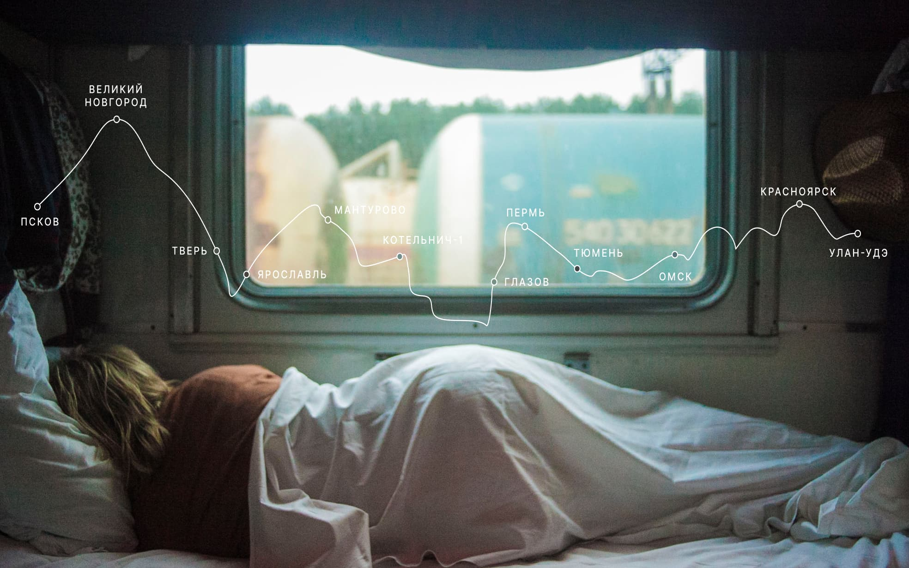

# Путешествие по России
> Настоящая страна не в выпусках новостей, а **[здесь](https://gmvrpw.github.io/russian-travel-bootcamp/)**.

## Что это?

Проект о путешестии по России и красоте самых дальних её уголков.  

## Дизайн

[Ссылка на макет в Figma](https://www.figma.com/file/5S2WSbEFL6awjVWJ0NWL8Q/Sprint-3_-Russia-_-desktop-mobile?node-id=28503%3A0)

## Техническая часть

* **Технологии**
  * [HTML5](https://www.w3.org/TR/2011/WD-html5-20110405/)
  * [CSS3](https://www.w3.org/Style/CSS/specs.en.html)
* **Методологии**
  * [BEM](https://en.bem.info/methodology/) 
